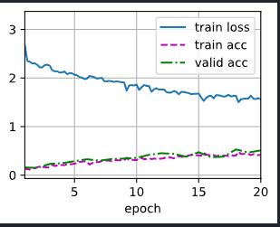
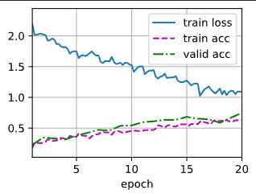
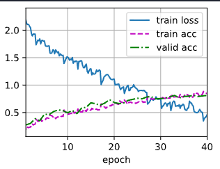

# Análise dos Resultados de Treinamento

Este documento apresenta uma análise detalhada dos resultados de treinamento provenientes de três testes realizados no modelo ResNet18 utilizando o conjunto de dados CIFAR-10. Cada teste representa uma etapa diferente de treinamento do modelo e ajuste de hiperparâmetros.

## Caso de Teste 1: Treinamento Inicial do Modelo

**Objetivo:**
Avaliar o desempenho inicial do modelo ResNet18 treinado no conjunto de dados CIFAR-10. (tiny)

**Detalhes:**
- **Épocas:** 20
- **Taxa de Aprendizado:** 0.001
- **Decaimento de Peso:** 5e-4
- **Decaimento da Taxa de Aprendizado:** 0.1 após 50 épocas

**Resultados:**
- **Perda no Treinamento:** Diminui gradualmente de ~3 para ~1.5 ao longo de 20 épocas.
- **Acurácia no Treinamento:** Aumenta, alcançando aproximadamente 0.423.
- **Acurácia na Validação:** Alcança aproximadamente 0.510.
- **Velocidade de Treinamento:** 195.8 exemplos/segundo em [device(type='cuda', index=0)]

**Análise:**
O treinamento inicial indica que o modelo está aprendendo de forma eficaz, com uma diminuição constante na perda de treinamento e um aumento tanto na acurácia de treinamento quanto na de validação. Curiosamente, a acurácia de validação é superior à de treinamento, o que pode indicar que o modelo está generalizando bem para os dados de validação.

```
loss 1.558, train acc 0.423, valid acc 0.510
195.8 examples/sec on [device(type='cuda', index=0)]
```




## Caso de Teste 2: Treinamento Intermediário do Modelo

**Objetivo:**
Avaliar o desempenho do modelo com hiperparâmetros ligeiramente modificados para melhorar a dinâmica de treinamento.

**Detalhes:**
- **Épocas:** 20
- **Taxa de Aprendizado:** 0.0001
- **Decaimento de Peso:** 5e-4
- **Decaimento da Taxa de Aprendizado:** 0.01 após 50 épocas

**Resultados:**
- **Perda no Treinamento:** Diminui de ~2 para ~1 ao longo de 20 épocas.
- **Acurácia no Treinamento:** Aumenta de forma constante, alcançando aproximadamente 0.632.
- **Acurácia na Validação:** Melhora consistentemente, alcançando aproximadamente 0.750.
- **Velocidade de Treinamento:** 193.7 exemplos/segundo em [device(type='cuda', index=0)]

**Análise:**
Este teste mostra uma melhoria significativa tanto na acurácia de treinamento quanto na de validação em comparação com o Teste 1. A redução da perda de treinamento e o aumento da acurácia indicam uma melhor eficiência de aprendizado, mantendo a generalização.

```
loss 1.091, train acc 0.632, valid acc 0.750
193.7 examples/sec on [device(type='cuda', index=0)]
```



## Caso de Teste 3: Treinamento Prolongado e Ajuste de Hiperparâmetros

**Objetivo:**
Otimizar ainda mais o modelo através de treinamento prolongado e ajustes refinados de hiperparâmetros.

**Detalhes:**
- **Épocas:** 40
- **Taxa de Aprendizado:** 0.0001
- **Decaimento de Peso:** 5e-4
- **Decaimento da Taxa de Aprendizado:** 0.001 após 50 épocas

**Resultados:**
- **Perda no Treinamento:** Diminui de ~2 para ~0.5 ao longo de 40 épocas.
- **Acurácia no Treinamento:** Aumenta de forma constante, alcançando aproximadamente 0.842.
- **Acurácia na Validação:** Mostra uma melhoria consistente, alcançando aproximadamente 0.812.
- **Velocidade de Treinamento:** 192.7 exemplos/segundo em [device(type='cuda', index=0)]

**Análise:**
O período prolongado de treinamento e os hiperparâmetros refinados resultam no melhor desempenho entre os três testes. O modelo atinge uma acurácia mais alta e uma perda menor, demonstrando melhorias nas capacidades de aprendizado e generalização. A acurácia de validação segue de perto a acurácia de treinamento, com um pequeno intervalo. Aumentar as épocas pode levar ao sobreajuste.



```
loss 0.462, train acc 0.842, valid acc 0.812
192.7 examples/sec on [device(type='cuda', index=0)]
```

## Documentação da API e Testes de Requisição

### Uso da API

A API foi desenvolvida utilizando Flask e PyTorch para servir um modelo treinado de classificação de imagens. A seguir, apresentamos exemplos de requisições de teste e uma análise dos resultados.

### Exemplo de Requisição

#### Teste 1: Classificação de Imagem de Avião

```
Arquivo: file: airplane.png
Resposta:

{
  "label": "airplane",
  "probabilities": {
    "airplane": 0.9897562861442566,
    "automobile": 0.009887656196951866,
    "bird": 0.000036429642932489514,
    "cat": 0.000011931071639992297,
    "deer": 1.041756103603575e-8,
    "dog": 0.000004110939244128531,
    "frog": 0.00009905370825435966,
    "horse": 0.000004234195785102202,
    "ship": 0.0001407461240887642,
    "truck": 0.00005963021976640448
  }
}

```

### Análise:
A imagem foi corretamente classificada como "airplane" com uma probabilidade muito alta de ~98.98%. As probabilidades das outras classes são significativamente menores, o que indica que o modelo está confiante em sua previsão. Isso demonstra que o modelo foi bem treinado para identificar aviões no conjunto de dados CIFAR-10.

#### Teste 2: Classificação de Imagem de Gato

```
Arquivo: file: cat.png
Resposta:

{
  "label": "cat",
  "probabilities": {
    "airplane": 0.00002190403756685555,
    "automobile": 0.002797812456265092,
    "bird": 0.004030129872262478,
    "cat": 0.971389651298523,
    "deer": 0.0011417524656280875,
    "dog": 0.012834093533456326,
    "frog": 0.00046498054871335626,
    "horse": 0.006881732493638992,
    "ship": 0.00023692169634159654,
    "truck": 0.00020117680833209306
  }
}

```

### Análise:
A imagem foi corretamente classificada como "cat" com uma alta probabilidade de ~97.14%. As outras classes têm probabilidades menores, mas é interessante notar que a classe "dog" tem uma probabilidade um pouco mais alta em comparação com as demais, o que pode ser devido a semelhanças visuais entre cães e gatos nas imagens do conjunto de dados.

Teste 3: Classificação de Imagem de Navio

```
Arquivo: file: ship.png
Resposta:

{
  "label": "ship",
  "probabilities": {
    "airplane": 0.0003665238036774099,
    "automobile": 0.000014573963198927231,
    "bird": 0.000003846018444164656,
    "cat": 0.00004500228533288464,
    "deer": 0.000012079336556780618,
    "dog": 0.0000016176577446458396,
    "frog": 0.0000014336189906316577,
    "horse": 0.000006605857834074413,
    "ship": 0.9987956285476685,
    "truck": 0.0007528595742769539
  }
}

```

### Análise:
A imagem foi corretamente classificada como "ship" com uma probabilidade extremamente alta de ~99.88%. As probabilidades das outras classes são quase insignificantes, indicando que o modelo está altamente confiante na previsão. Esse resultado sugere que o modelo tem uma excelente capacidade de identificar navios no conjunto de dados CIFAR-10 (tiny).

### Conclusão
Os resultados das três requisições de teste mostram que o modelo ResNet18 treinado no CIFAR-10 tiny está performando bem em classificar diferentes categorias de imagens com alta acurácia. As probabilidades associadas às classes corretas são significativamente maiores, evidenciando a eficácia do treinamento e ajuste de hiperparâmetros realizados. O modelo demonstra uma boa capacidade de generalização, mantendo uma alta precisão nas predições realizadas.

## Fontes

Para mais detalhes sobre a abordagem utilizada no treinamento de modelos para classificação de imagens no conjunto de dados CIFAR-10, consulte a documentação e exemplos disponíveis no link abaixo:

[Kaggle CIFAR-10 - D2L](https://pt.d2l.ai/chapter_computer-vision/kaggle-cifar10.html)